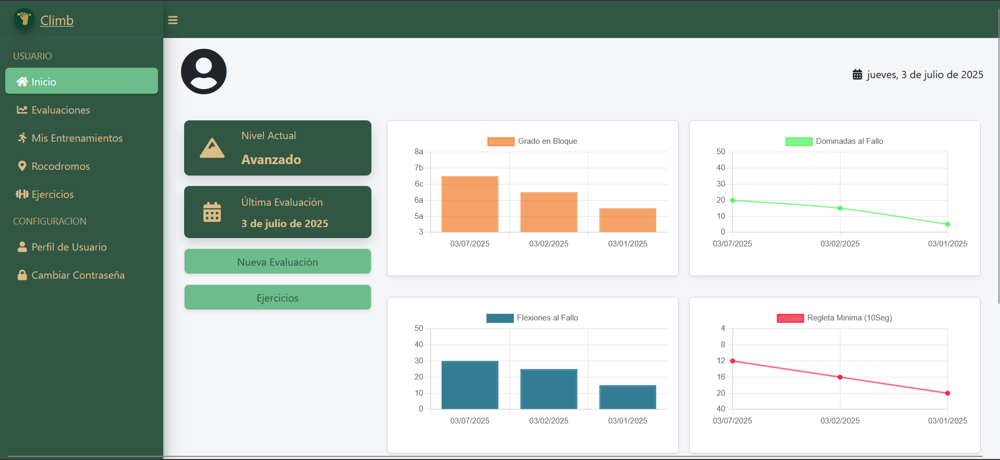

# 🧗‍♂️ App Escalada

Aplicación web para la planificación de entrenamientos personalizados de escalada en bloque (*Boulder*). Proyecto desarrollado como Proyecto Final del Ciclo Formativo de Desarrollo de Aplicaciones Web.

---

## 📋 Descripción

**App Escalada** permite a los escaladores crear un perfil, autoevaluar su nivel físico y técnico, y generar un plan de entrenamiento adaptado a su nivel y objetivos. La aplicación incluye funcionalidades de seguimiento de progreso, descarga de planes en PDF y localización de rocódromos cercanos.

---

## ✨ Características principales

✅ Registro y autenticación de usuarios (Laravel Jetstream)  
✅ Sistema de autoevaluación con asignación automática de nivel (Iniciación, Intermedio, Avanzado)  
✅ Generación de planes de entrenamiento personalizados (mesociclo 3-2-1)  
✅ Interacción con el plan: marcar ejercicios completados y seguimiento de días  
✅ Gráficas dinámicas de progreso (Chart.js)  
✅ Descarga del plan de entrenamiento en PDF (DomPDF)  
✅ Localización de rocódromos cercanos mediante GPS  
✅ Gestión de ejercicios (solo administradores)

---

## 🛠️ Tecnologías utilizadas en este proyecto

**Backend**
- PHP (Laravel)

**Frontend**
- HTML5
- CSS3
- JavaScript
- AdminLTE (plantilla de interfaz)

**Base de datos**
- MySQL (migraciones con Laravel)

**Otras librerías**
- Laravel Jetstream (autenticación)
- Chart.js (gráficas)
- DomPDF (PDF)

🖼️ Capturas de pantalla
    

      
    

    

        
    

    

        
    

    

        
    

